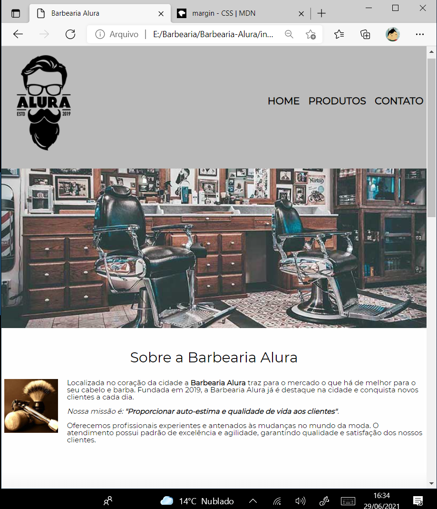
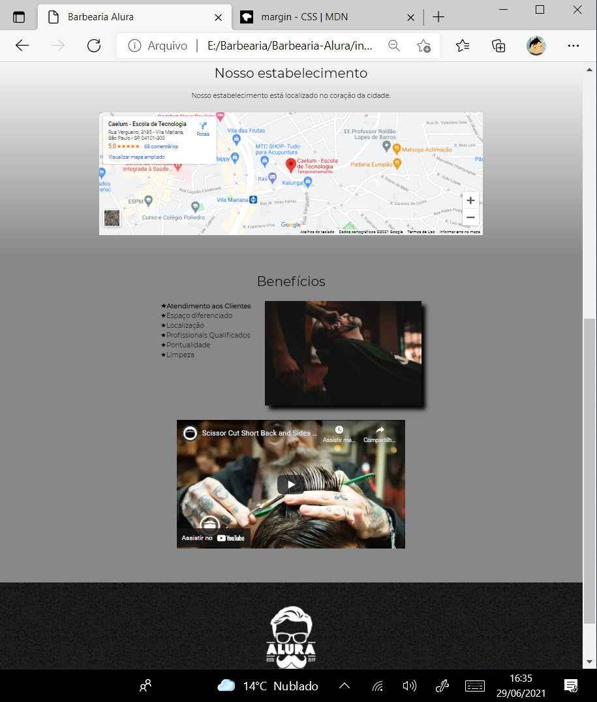
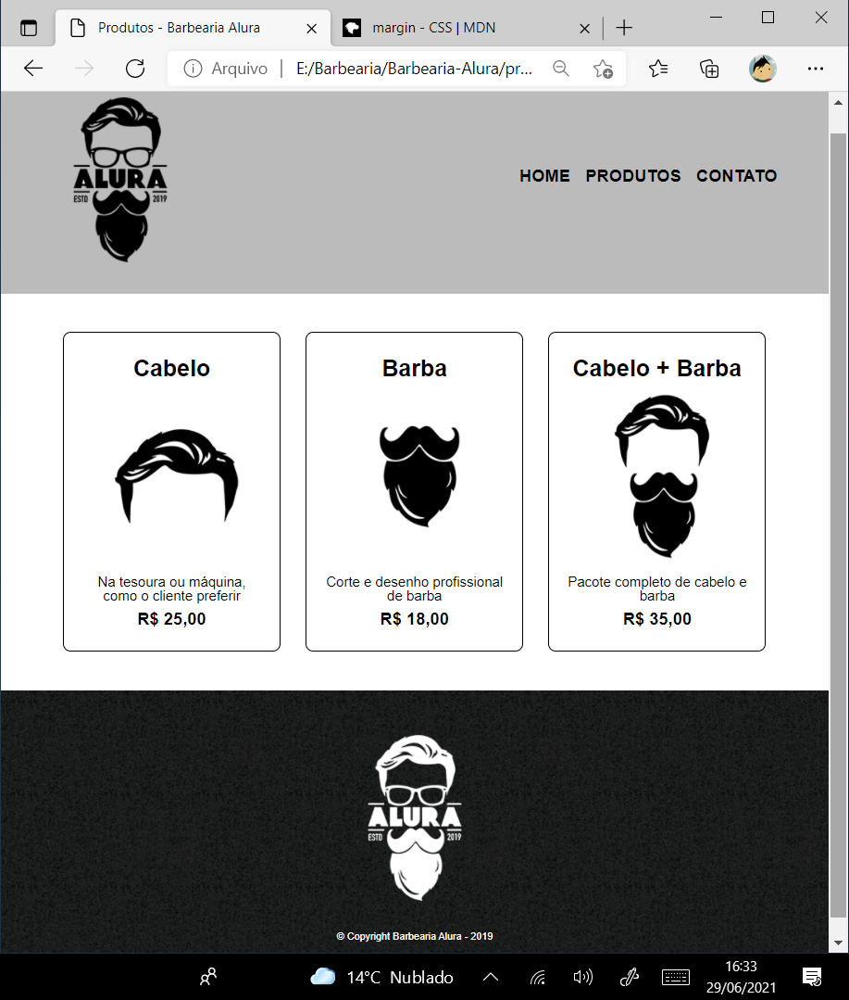
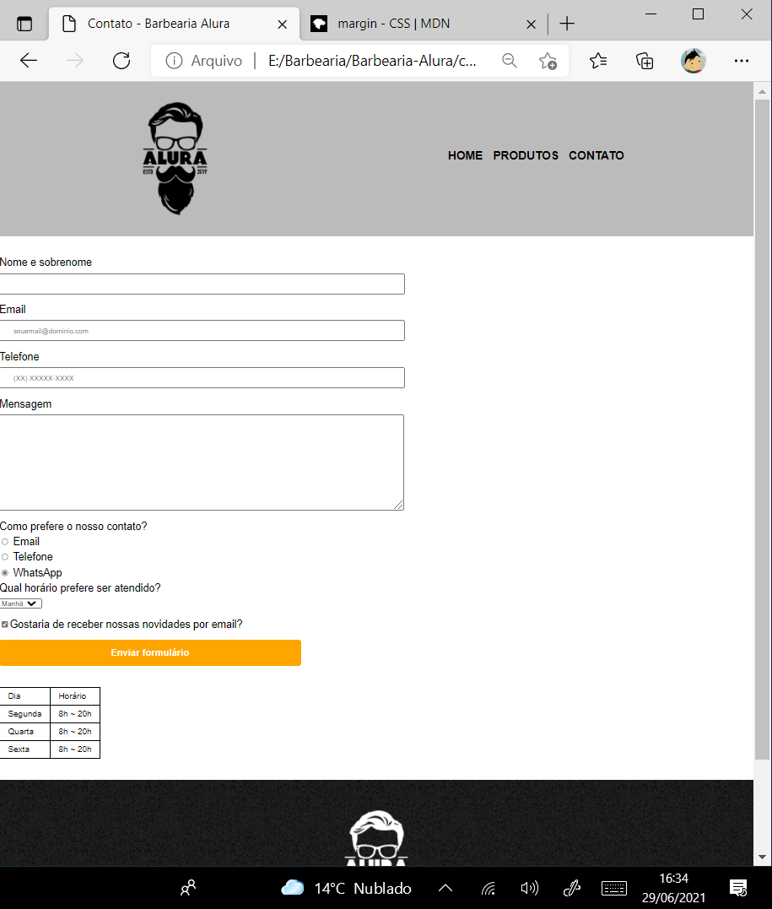

# Site Barbearia-Alura
## Site voltado a apresentação de uma barbearia, onde apresenta informações sobre a mesma com a opção de agendamento de horário na página contato.

<h1 align="center">
  
</h1>

 <a href="#sobre-o-projeto">Sobre</a> •
 <a href="#funcionalidades">Funcionalidades</a> •
 <a href="#layout">Layout</a> • 
 <a href="#tecnologias">Tecnologias</a> • 
 <a href="#user-content--licença">Licença</a>

<h4 align="center"> 
	🚧  Barbearia-Alura ✂️ Finalizado  🚧
</h4>

## 💻Sobre o projeto

✂️ Barbearia-Alura foi um projeto que desenvolvido durante os módulos de formação de front-end da Alura no que diz respeito a html e ccs.

Esse projeto foi desenvolvido para o estudo de implementação de conceitos básicos e boas práticas adotados na criação de páginas web abordado diversos temas como posicionameto, listas, navegação, formularios, tabelas...
---

## Funcionalidades

-Basicamente o site consiste de apenas 3 páginas pois o fim é apenas didático e introdutório no html e css, sendo essas páginas o index, produtos e contato:

  Página Index:
  
  Nesta página estava localizada as informações principais referente a barbearia, com uma barra de navegação, seguido de um texto introdutório, uma localização importada no google maps e um video próximo ao rodapé importado do youtube. Nessa página foi abordada conceitos basilares como encadeamento, tags utilizada para a criação de um arquivo html, implementação de fonte externa e muito mais...
  
  
  
  
  ---
  
  Página Produtos ofertados:
  
  Nesta página estava os produtos ofertados pela barbearia, onde o desenvolvimento dessa página tinha mais como objetivo trabalhar o css através da implementação de hover, box-sizing e border em listas.
 
 
 
 ---
 
  Página Contatos:
  
  Na página contato iniciamos os trabalhos com a criação de formulário, com a implemetação da label e varios tipos de input(checkbox, radio, text, email, tel e sunmit).
  

---

## 🎨Layout

O layout foi fornecido pelo professor do Alura 
[Pedro Marins](https://www.linkedin.com/in/pedromarins/) :

### 🛠Tecnologias

As seguintes ferramentas foram usadas na construção do projeto:

- [HTML](https://www.w3schools.com/html/default.asp)
- [CSS](https://www.w3schools.com/css/)
- [VisualStudio](https://visualstudio.microsoft.com/pt-br/)

---

## 📝Licença

Este projeto esta sobe a licença [MIT](./LICENSE).

Feito por Marcelo Laurentino👋🏽 [Entre em contato!](https://www.linkedin.com/in/marcelo-laurentino-8a54ba114/)

